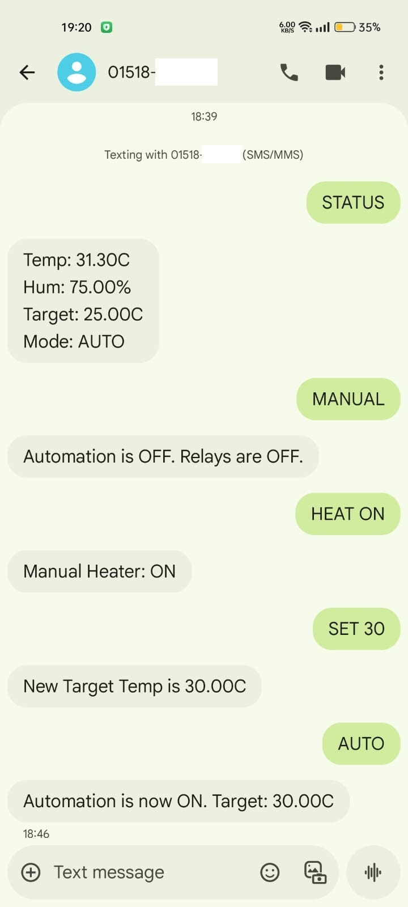
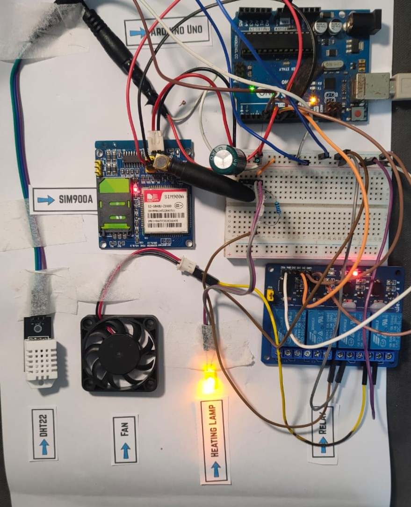
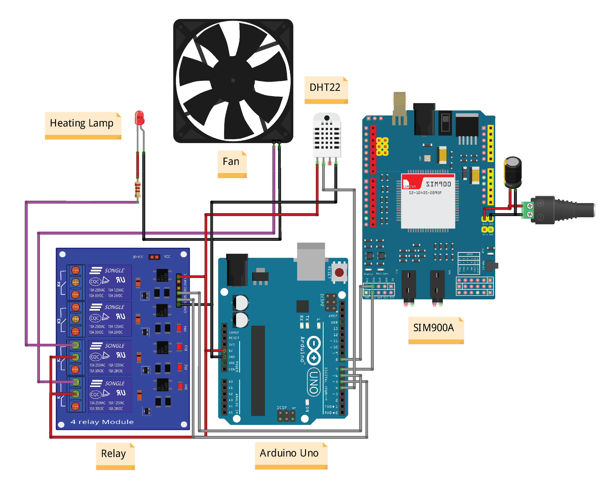

# SMS-Controlled Automated Thermostat for Smart Agriculture

This is a low-cost, reliable thermostat system that monitors and controls temperature for agricultural use (like poultry farms) using an Arduino and a SIM900A GSM module. It works without WiFi, allowing for full control via SMS text messages.

## The Problem

Young livestock, especially poultry, are highly sensitive to temperature. In remote or rural areas, WiFi is often unavailable or unstable, making it impossible to use modern "smart" solutions. A failed heater or a cold night can lead to high mortality rates and large financial losses for farmers.

## The Solution

This system automates a fan (for cooling) and a heating lamp (for warming) to maintain a precise target temperature. A farmer can monitor and control the entire system from any simple mobile phone using SMS commands, providing 24/7 peace of mind.

---

## Features

* **Full Automation:** Automatically maintains a target temperature by controlling a fan and heater.
* **Complete SMS Control:** Works anywhere with a 2G mobile signal.
* **Instant Status Reports:** Send `STATUS` to get back the current temperature, humidity, and mode.
* **Remote Target Setting:** Send `SET 30` to change the target temperature to 30°C.
* **Manual Override:** Send `MANUAL` to disable automation and `HEAT ON` or `FAN ON` to take direct control.

---

## Hardware Used

* Arduino Uno
* SIM900A GSM Module (with external 5V 2A power & 1000uF capacitor)
* DHT22 Temperature & Humidity Sensor
* 2-Channel 5V Relay Module
* 12V Fan (for cooling)
* Heating Lamp (for warming)

---

## System in Action

**Software (SMS Proof):**
The system sends and receives simple commands.

**Hardware (Prototype):**
The working prototype, showing the "Heating Lamp" turned on via SMS.

---

## Circuit Diagram

---

## Code

The main Arduino code for this project is available in this repository:
* (agri_tech.ino) 

